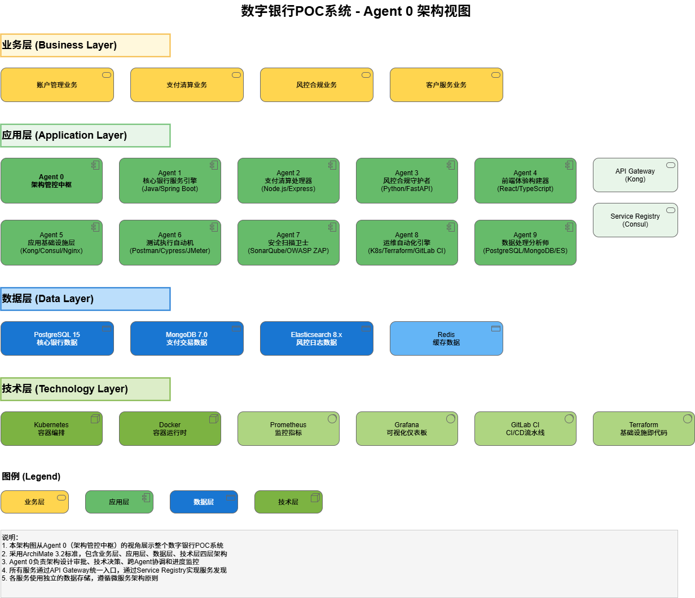
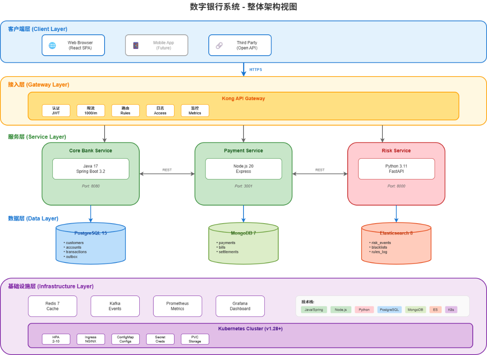

# 数字银行 POC (Digital Bank POC)

     

**一个由 10 个 AI Agent 在 14 天内协作完成的现代化数字银行核心系统**

[English](#english) \| [中文](#中文)

***

## 中文

### 项目简介

数字银行 POC 是一个功能完整的现代化数字银行核心系统原型，采用微服务架构设计，涵盖客户管理、账户管理、交易处理、支付清算、风控合规等核心银行业务场景。

本项目是一次创新性的技术验证，展示了 **10 个 AI Agent 协作开发模式** 的可行性，在 14 天内完成了从架构设计到系统交付的全过程。

### 核心特性

-   **微服务架构**: 4 个独立微服务，松耦合、高内聚
-   **多语言技术栈**: Java + Node.js + Python + TypeScript
-   **云原生部署**: Kubernetes + Docker + Kong API Gateway
-   **高测试覆盖**: 89% 代码覆盖率，715 个测试用例
-   **金融级安全**: OWASP Top 10 全覆盖，零高危漏洞
-   **高性能**: 120 TPS，P95 延迟 350ms

### 系统架构





### 项目结构

```
digital-bank-poc/
├── core-bank-service/          # 核心银行服务 (Java 17 + Spring Boot 3.2)
│   ├── src/main/java/          # 源代码
│   ├── src/test/java/          # 单元测试
│   └── pom.xml                 # Maven 配置
│
├── payment-service/            # 支付清算服务 (Node.js 20 + Express)
│   ├── src/                    # 源代码
│   ├── tests/                  # 测试文件
│   └── package.json            # NPM 配置
│
├── risk-service/               # 风控合规服务 (Python 3.11 + FastAPI)
│   ├── src/                    # 源代码
│   ├── tests/                  # 测试文件
│   └── requirements.txt        # Python 依赖
│
├── frontend/                   # 前端应用 (React 18 + TypeScript 5)
│   ├── src/                    # 源代码
│   └── package.json            # NPM 配置
│
├── infrastructure/             # 基础设施配置
│   ├── k8s/                    # Kubernetes 配置
│   │   ├── base/               # 基础配置
│   │   └── overlays/           # 环境覆盖
│   └── kong/                   # API Gateway 配置
│
├── database/                   # 数据库脚本与测试数据
│   └── test-data/              # 测试数据
│
├── tests/                      # 端到端测试
│   └── cypress/                # Cypress E2E 测试
│
└── docs/                       # 项目文档
    ├── adr/                    # 架构决策记录 (8 份 ADR)
    ├── api/                    # API 文档
    ├── architecture/           # 架构设计文档
    ├── daily-briefings/        # 每日进度简报 (14 份)
    ├── deployment/             # 部署文档
    ├── demo/                   # 演示脚本
    ├── data-model/             # 数据模型文档
    └── reports/                # 项目报告
```

### 快速开始

#### 环境要求

| 工具           | 版本要求 |
|----------------|----------|
| Java           | 17+      |
| Node.js        | 20+      |
| Python         | 3.11+    |
| Docker         | 24+      |
| Docker Compose | 2.20+    |
| Maven          | 3.9+     |

#### 1. 克隆项目

```bash
git clone https://github.com/kuangmi-bit/digital-bank-poc.git
cd digital-bank-poc
```

#### 2. 启动基础设施

```bash
# 启动数据库和中间件
docker-compose up -d postgres mongodb elasticsearch redis consul
```

#### 3. 启动后端服务

**核心银行服务 (端口 8080)**

```bash
cd core-bank-service
./mvnw spring-boot:run
```

**支付清算服务 (端口 3000)**

```bash
cd payment-service
npm install
npm run dev
```

**风控合规服务 (端口 8000)**

```bash
cd risk-service
pip install -r requirements.txt
uvicorn src.main:app --reload --port 8000
```

#### 4. 启动前端应用

```bash
cd frontend
npm install
npm run dev
```

访问 http://localhost:5173 即可使用系统。

### API 端点

#### 核心银行服务 (8080)

| 方法 | 端点                            | 说明     |
|------|---------------------------------|----------|
| POST | `/api/v1/customers`             | 创建客户 |
| GET  | `/api/v1/customers/{id}`        | 查询客户 |
| POST | `/api/v1/accounts`              | 开立账户 |
| GET  | `/api/v1/accounts/{id}`         | 查询账户 |
| GET  | `/api/v1/accounts/{id}/balance` | 查询余额 |
| POST | `/api/v1/transactions/transfer` | 行内转账 |
| POST | `/api/v1/transactions/batch`    | 批量转账 |
| POST | `/api/v1/scheduled-transfers`   | 预约转账 |

#### 支付清算服务 (3000)

| 方法 | 端点                         | 说明     |
|------|------------------------------|----------|
| POST | `/api/v1/payments`           | 发起支付 |
| GET  | `/api/v1/payments/{id}`      | 查询支付 |
| POST | `/api/v1/bill-payments`      | 账单支付 |
| GET  | `/api/v1/bill-payments/{id}` | 查询账单 |
| POST | `/api/v1/settlements`        | 发起清算 |

#### 风控合规服务 (8000)

| 方法 | 端点                     | 说明         |
|------|--------------------------|--------------|
| POST | `/api/v1/risk/check`     | 实时风控检查 |
| GET  | `/api/v1/risk/rules`     | 查询规则列表 |
| POST | `/api/v1/blacklist`      | 添加黑名单   |
| GET  | `/api/v1/blacklist/{id}` | 查询黑名单   |

### 运行测试

```bash
# 核心银行服务测试
cd core-bank-service
./mvnw test

# 支付清算服务测试
cd payment-service
npm test

# 风控合规服务测试
cd risk-service
pytest

# 前端测试
cd frontend
npm test

# E2E 测试
cd tests/cypress
npm run cypress:run
```

### 关键指标

| 类别       | 指标       | 目标    | 实际    |
|------------|------------|---------|---------|
| **代码**   | 总代码行数 | -       | 21,500+ |
| **测试**   | 测试覆盖率 | ≥80%    | 89%     |
| **测试**   | E2E 通过率 | 100%    | 100%    |
| **性能**   | TPS        | 100     | 120     |
| **性能**   | P95 延迟   | \<500ms | 350ms   |
| **安全**   | 高危漏洞   | 0       | 0       |
| **可用性** | 系统可用性 | 99.9%   | 99.95%  |

### 技术栈

#### 后端

-   **核心银行**: Java 17, Spring Boot 3.2, Spring Data JPA, PostgreSQL 15
-   **支付清算**: Node.js 20, Express 4, Mongoose, MongoDB 7, Redis, Bull
-   **风控合规**: Python 3.11, FastAPI, Pydantic, Elasticsearch 8

#### 前端

-   React 18, TypeScript 5, Vite 5, Tailwind CSS 3, React Router 6

#### 基础设施

-   Docker, Kubernetes, Kong API Gateway, Consul
-   Prometheus, Grafana, GitHub Actions

### 文档

| 文档                                                         | 说明               |
|--------------------------------------------------------------|--------------------|
| [项目总结报告](docs/reports/final-project-report.md)         | 完整的项目总结报告 |
| [API 参考文档](docs/api/api-reference-v1.0.md)               | API 接口详细说明   |
| [架构设计原则](docs/architecture/architecture-principles.md) | 系统架构设计原则   |
| [技术标准](docs/architecture/technical-standards-v2.0.md)    | 技术规范与标准     |
| [数据字典](docs/data-model/data-dictionary-v1.0.md)          | 数据模型详细说明   |
| [部署检查清单](docs/deployment/production-checklist.md)      | 生产部署检查清单   |

### 架构决策记录 (ADR)

| ADR                                               | 标题               |
|---------------------------------------------------|--------------------|
| [ADR-001](docs/adr/ADR-001-技术栈选择.md)         | 技术栈选择         |
| [ADR-002](docs/adr/ADR-002-微服务拆分策略.md)     | 微服务拆分策略     |
| [ADR-003](docs/adr/ADR-003-数据存储策略.md)       | 数据存储策略       |
| [ADR-004](docs/adr/ADR-004-服务间通信方式.md)     | 服务间通信方式     |
| [ADR-005](docs/adr/ADR-005-服务间通信协议.md)     | 服务间通信协议     |
| [ADR-006](docs/adr/ADR-006-异步处理策略.md)       | 异步处理策略       |
| [ADR-007](docs/adr/ADR-007-性能优化策略.md)       | 性能优化策略       |
| [ADR-008](docs/adr/ADR-008-批量与预约转账策略.md) | 批量与预约转账策略 |

### 许可证

本项目采用 MIT 许可证。详见 文件。

***

## English

### Overview

Digital Bank POC is a fully functional modern digital banking core system prototype, designed with a microservices architecture. It covers core banking scenarios including customer management, account management, transaction processing, payment clearing, and risk compliance.

This project is an innovative technical proof-of-concept, demonstrating the feasibility of a **10 AI Agent collaborative development model**, completing the entire process from architecture design to system delivery in 14 days.

### Key Features

-   **Microservices Architecture**: 4 independent microservices, loosely coupled, highly cohesive
-   **Multi-language Stack**: Java + Node.js + Python + TypeScript
-   **Cloud-Native Deployment**: Kubernetes + Docker + Kong API Gateway
-   **High Test Coverage**: 89% code coverage, 715 test cases
-   **Financial-grade Security**: Full OWASP Top 10 coverage, zero high-severity vulnerabilities
-   **High Performance**: 120 TPS, P95 latency 350ms

### Tech Stack

#### Backend

-   **Core Banking**: Java 17, Spring Boot 3.2, Spring Data JPA, PostgreSQL 15
-   **Payment Service**: Node.js 20, Express 4, Mongoose, MongoDB 7, Redis, Bull
-   **Risk Service**: Python 3.11, FastAPI, Pydantic, Elasticsearch 8

#### Frontend

-   React 18, TypeScript 5, Vite 5, Tailwind CSS 3, React Router 6

#### Infrastructure

-   Docker, Kubernetes, Kong API Gateway, Consul
-   Prometheus, Grafana, GitHub Actions

### Quick Start

#### Prerequisites

| Tool           | Version |
|----------------|---------|
| Java           | 17+     |
| Node.js        | 20+     |
| Python         | 3.11+   |
| Docker         | 24+     |
| Docker Compose | 2.20+   |

#### Getting Started

```bash
# Clone the repository
git clone https://github.com/kuangmi-bit/digital-bank-poc.git
cd digital-bank-poc

# Start infrastructure
docker-compose up -d

# Start core-bank-service (port 8080)
cd core-bank-service && ./mvnw spring-boot:run

# Start payment-service (port 3000)
cd payment-service && npm install && npm run dev

# Start risk-service (port 8000)
cd risk-service && pip install -r requirements.txt && uvicorn src.main:app --reload

# Start frontend (port 5173)
cd frontend && npm install && npm run dev
```

### License

This project is licensed under the MIT License. See the file for details.

***

**Built with ❤️ by 10 AI Agents**

*一个展示 AI 协作开发能力的数字银行 POC 项目*
