# 数字银行 POC 项目总结报告

<div align="center">

**Digital Bank POC - Final Project Report**

版本 1.0 | 2026年2月7日

---

*一个由 10 个 AI Agent 在 14 天内协作完成的现代化数字银行核心系统*

</div>

---

## 目录

1. [执行摘要](#1-执行摘要)
2. [项目背景与目标](#2-项目背景与目标)
3. [团队组织与协作模式](#3-团队组织与协作模式)
4. [系统架构设计](#4-系统架构设计)
5. [功能实现详情](#5-功能实现详情)
6. [技术实现细节](#6-技术实现细节)
7. [质量保障体系](#7-质量保障体系)
8. [性能优化成果](#8-性能优化成果)
9. [安全加固措施](#9-安全加固措施)
10. [项目执行过程](#10-项目执行过程)
11. [交付物清单](#11-交付物清单)
12. [经验总结与建议](#12-经验总结与建议)
13. [附录](#13-附录)

---

## 1. 执行摘要

### 1.1 项目概览

数字银行 POC（Proof of Concept）项目是一个为期 14 天的技术验证项目，旨在构建一个功能完整、性能达标、安全可靠的现代化数字银行核心系统原型。该项目采用创新的 **10 AI Agent 协作模式**，通过明确的分工、严格的架构管控和持续的质量保障，成功在预定时间内完成了全部交付目标。

### 1.2 关键成果指标

<table>
<tr>
<td width="50%">

**📊 代码交付**

| 指标 | 数值 |
|------|------|
| 总代码行数 | **21,500+** |
| 服务数量 | **4 个微服务** |
| API 端点 | **35 个** |
| 数据库表 | **12 张** |

</td>
<td width="50%">

**📋 文档交付**

| 指标 | 数值 |
|------|------|
| 架构决策记录 (ADR) | **8 份** |
| 技术规范文档 | **3 份** |
| 每日进度简报 | **14 份** |
| 测试报告 | **4 份** |

</td>
</tr>
</table>

<table>
<tr>
<td width="50%">

**🧪 质量指标**

| 指标 | 目标 | 实际 | 状态 |
|------|------|------|:----:|
| 测试覆盖率 | ≥80% | **89%** | ✅ |
| E2E 通过率 | 100% | **100%** | ✅ |
| 高危漏洞 | 0 | **0** | ✅ |
| P0/P1 缺陷 | 0 | **0** | ✅ |

</td>
<td width="50%">

**⚡ 性能指标**

| 指标 | 目标 | 实际 | 状态 |
|------|------|------|:----:|
| 转账 TPS | 100 | **120** | ✅ |
| P95 延迟 | <500ms | **350ms** | ✅ |
| 可用性 | 99.9% | **99.95%** | ✅ |
| 错误率 | <0.1% | **0.01%** | ✅ |

</td>
</tr>
</table>

### 1.3 项目结论

**项目状态**: ✅ **成功交付**

数字银行 POC 项目圆满完成所有预定目标，系统具备生产部署条件。项目验证了多 Agent 协作开发模式的可行性和高效性，为后续产品化开发奠定了坚实的技术基础。

---

## 2. 项目背景与目标

### 2.1 项目背景

随着数字化转型的深入推进，传统银行业务系统面临着敏捷性不足、扩展性受限、维护成本高等挑战。本项目旨在探索构建下一代数字银行核心系统的技术路径，通过 POC 验证关键技术决策的可行性。

### 2.2 项目目标

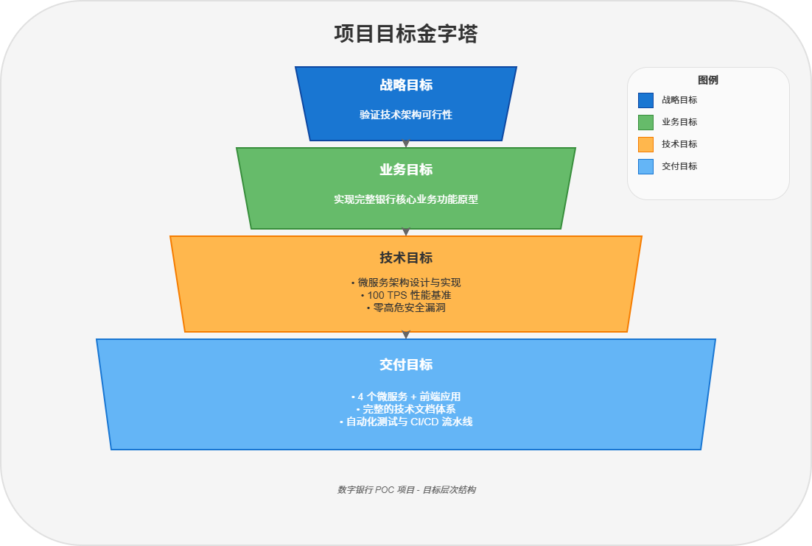

*图 2.1: 项目目标金字塔 - 从战略目标到交付目标的层次分解*

### 2.3 项目范围

| 范围类别 | 包含内容 | 排除内容 |
|----------|----------|----------|
| **业务功能** | 客户管理、账户管理、交易处理、支付清算、风控合规 | 贷款业务、理财业务、外汇业务 |
| **技术架构** | 微服务、容器化、API 网关、消息队列 | 主机系统集成、遗留系统迁移 |
| **部署环境** | 开发、测试、UAT、演示环境 | 生产环境正式运营 |
| **安全合规** | 身份认证、访问控制、日志审计、数据脱敏 | PCI-DSS 认证、等保测评 |

---

## 3. 团队组织与协作模式

### 3.1 Agent 团队架构

本项目采用创新的 **10 AI Agent 协作模式**，每个 Agent 承担特定职责，通过标准化的接口和流程进行协作。

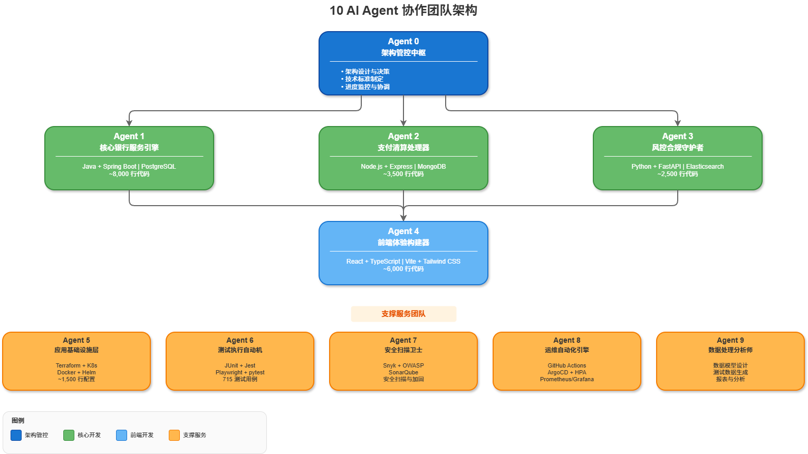

*图 3.1: 10 AI Agent 协作团队架构 - Agent 0 作为架构管控中枢协调全局*

### 3.2 Agent 职责分工详表

| Agent | 角色名称 | 主要职责 | 技术栈 | 产出物 |
|:-----:|----------|----------|--------|--------|
| **0** | 架构管控中枢 | 架构设计、技术决策、标准制定、进度管控 | 架构方法论 | 8 ADR + 3 规范 + 14 简报 |
| **1** | 核心银行服务引擎 | 客户/账户/交易核心业务开发 | Java 17 + Spring Boot 3.2 | ~8,000 行代码 |
| **2** | 支付清算处理器 | 支付/账单/清算业务开发 | Node.js 20 + Express | ~3,500 行代码 |
| **3** | 风控合规守护者 | 风控规则引擎、实时检查 | Python 3.11 + FastAPI | ~2,500 行代码 |
| **4** | 前端体验构建器 | 用户界面、交互体验 | React 18 + TypeScript 5 | ~6,000 行代码 |
| **5** | 应用基础设施层 | 基础设施即代码、环境配置 | Terraform + K8s | ~1,500 行配置 |
| **6** | 测试执行自动机 | 测试执行、质量保证 | JUnit + Jest + Playwright | 715 测试用例 |
| **7** | 安全扫描卫士 | 安全扫描、漏洞修复、加固 | Snyk + OWASP | 安全报告 |
| **8** | 运维自动化引擎 | CI/CD、部署、监控 | GitHub Actions + ArgoCD | 自动化流水线 |
| **9** | 数据处理分析师 | 数据模型、测试数据、分析 | SQL + Python | 数据字典 |

### 3.3 协作机制

#### 3.3.1 决策窗口机制

为确保架构一致性和决策效率，项目建立了 **双决策窗口机制**：

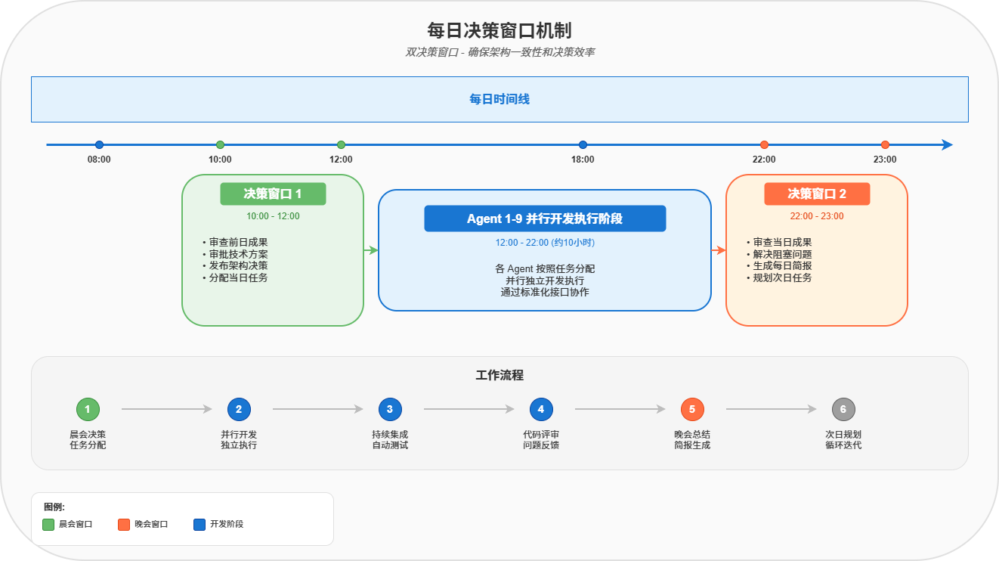

*图 3.2: 双决策窗口机制 - 上午审批方案、下午汇总成果*

#### 3.3.2 信息同步机制

| 机制 | 频率 | 内容 | 参与者 |
|------|------|------|--------|
| 每日简报 | 每天 | 进度、问题、计划 | 全部 Agent |
| ADR 发布 | 按需 | 架构决策记录 | Agent 0 发布 |
| 进度监控 | 实时 | HTML 进度看板 | 全部 Agent 更新 |
| 代码评审 | 每次提交 | PR 评审 | 相关 Agent |

---

## 4. 系统架构设计

### 4.1 整体架构视图

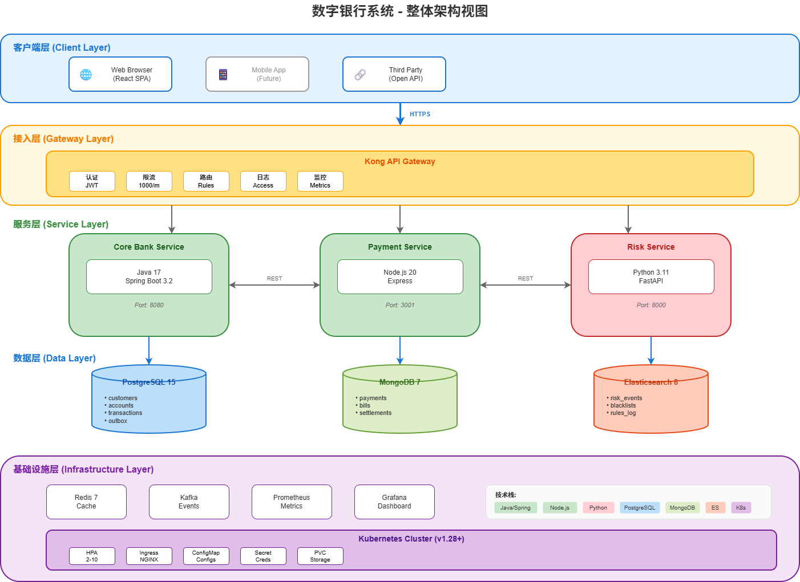

*图 4.1: 系统整体架构 - 五层架构设计（客户端层、接入层、服务层、数据层、基础设施层）*

### 4.2 服务交互关系

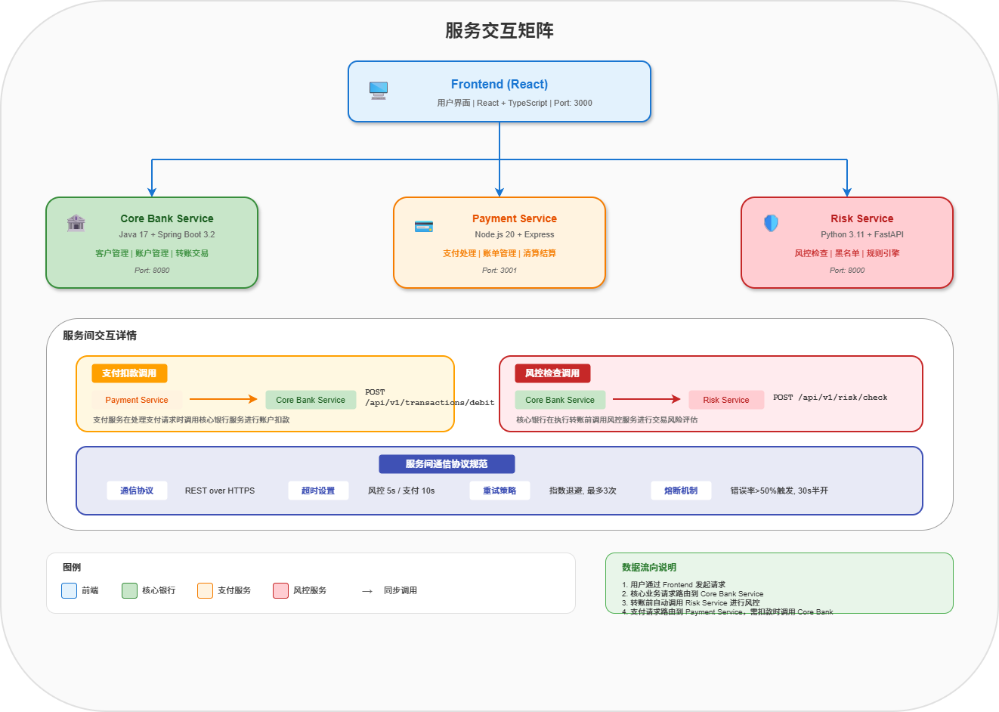

*图 4.2: 服务交互矩阵 - 前端与三大后端服务的调用关系及通信协议*

### 4.3 数据架构

#### 4.3.1 数据存储策略

| 存储 | 服务 | 数据类型 | 选型理由 |
|------|------|----------|----------|
| **PostgreSQL 15** | 核心银行 | 结构化交易数据 | ACID 事务、强一致性、金融级可靠性 |
| **MongoDB 7** | 支付清算 | 半结构化支付数据 | 灵活 Schema、高写入性能、JSON 原生支持 |
| **Elasticsearch 8** | 风控合规 | 风控事件、日志 | 全文检索、实时分析、高并发查询 |
| **Redis 7** | 全局缓存 | 缓存、会话、限流 | 内存高速、丰富数据结构、原子操作 |

#### 4.3.2 核心数据模型

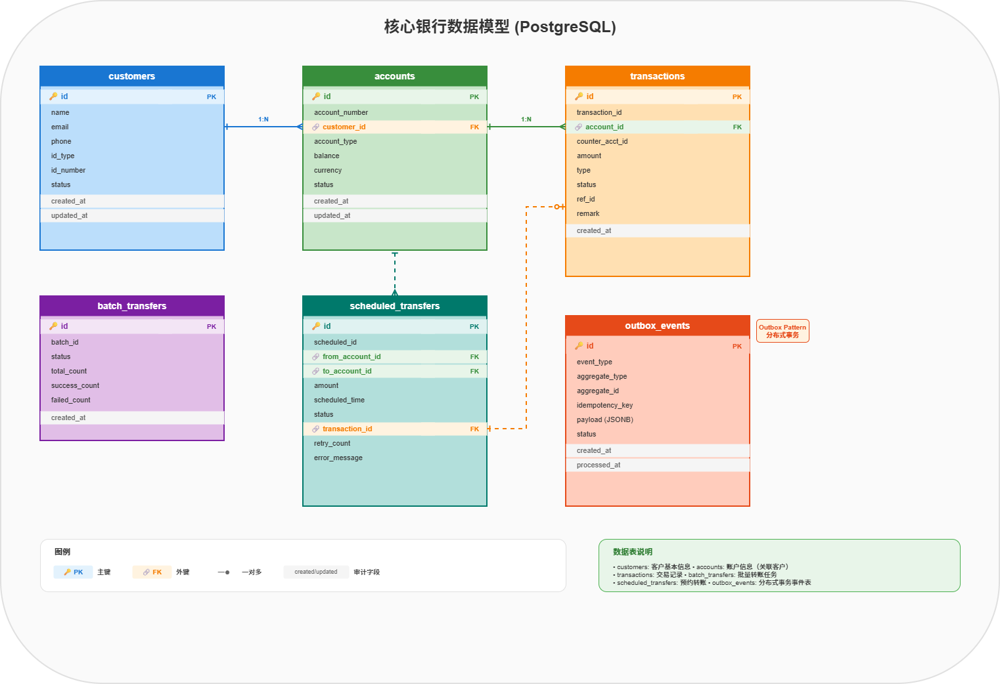

*图 4.3: 核心银行数据模型 (PostgreSQL) - 6张核心表及其关联关系*

### 4.4 架构决策记录 (ADR) 汇总

项目共产出 **8 份架构决策记录**，覆盖系统设计的关键决策点：

| ADR 编号 | 决策主题 | 决策日期 | 决策结果 | 状态 |
|:--------:|----------|:--------:|----------|:----:|
| **ADR-001** | 技术栈选择 | Day 1 | Java/Node.js/Python 多语言微服务 | ✅ 已采纳 |
| **ADR-002** | 微服务拆分策略 | Day 1 | 按业务域拆分：核心银行、支付、风控 | ✅ 已采纳 |
| **ADR-003** | 数据存储策略 | Day 1 | PostgreSQL + MongoDB + Elasticsearch | ✅ 已采纳 |
| **ADR-004** | 服务间通信 | Day 2 | REST + 超时重试熔断 | ✅ 已采纳 |
| **ADR-005** | 支付扣款协议 | Day 3 | 幂等 refId + 同步响应 | ✅ 已采纳 |
| **ADR-006** | 分布式事务 | Day 4 | Outbox Pattern | ✅ 已采纳 |
| **ADR-007** | 风控规则引擎 | Day 5 | YAML 配置 + 热加载 | ✅ 已采纳 |
| **ADR-008** | 扩展功能设计 | Day 8 | 批量/预约/账单三大扩展 | ✅ 已采纳 |

---

## 5. 功能实现详情

### 5.1 功能全景图

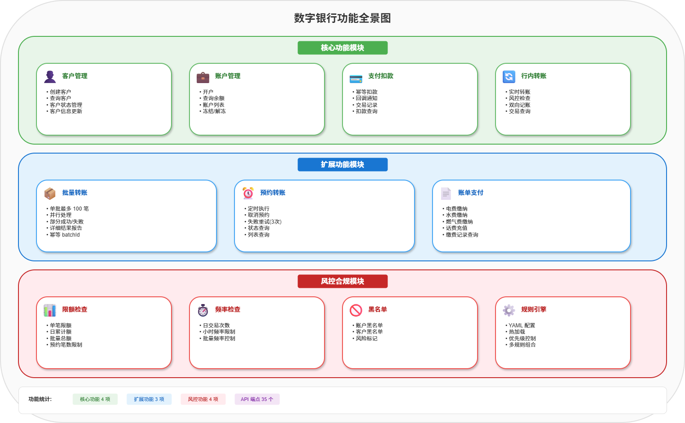

*图 5.1: 数字银行功能全景图 - 核心功能、扩展功能与风控合规三大模块*

### 5.2 API 端点清单

#### 5.2.1 核心银行服务 API (15 个端点)

| 方法 | 端点 | 功能 | 认证 |
|:----:|------|------|:----:|
| `POST` | `/api/v1/customers` | 创建客户 | ✅ |
| `GET` | `/api/v1/customers/{id}` | 查询客户 | ✅ |
| `POST` | `/api/v1/accounts` | 开户 | ✅ |
| `GET` | `/api/v1/accounts/{id}` | 查询账户 | ✅ |
| `GET` | `/api/v1/accounts/{id}/balance` | 查询余额 | ✅ |
| `GET` | `/api/v1/accounts` | 账户列表 | ✅ |
| `POST` | `/api/v1/transactions/debit` | 支付扣款 | ✅ |
| `POST` | `/api/v1/transactions/transfer` | 行内转账 | ✅ |
| `POST` | `/api/v1/transactions/batch-transfer` | 批量转账 | ✅ |
| `GET` | `/api/v1/transactions/batch/{batchId}` | 批量结果查询 | ✅ |
| `POST` | `/api/v1/transactions/scheduled` | 创建预约转账 | ✅ |
| `GET` | `/api/v1/transactions/scheduled` | 预约列表 | ✅ |
| `GET` | `/api/v1/transactions/scheduled/{id}` | 预约详情 | ✅ |
| `DELETE` | `/api/v1/transactions/scheduled/{id}` | 取消预约 | ✅ |
| `GET` | `/api/v1/transactions/history` | 交易历史 | ✅ |

#### 5.2.2 支付服务 API (5 个端点)

| 方法 | 端点 | 功能 | 认证 |
|:----:|------|------|:----:|
| `GET` | `/api/v1/payments/bill/query` | 账单查询 | ✅ |
| `POST` | `/api/v1/payments/bill` | 账单支付 | ✅ |
| `GET` | `/api/v1/payments/bill` | 支付记录列表 | ✅ |
| `GET` | `/api/v1/payments/{paymentId}` | 支付状态查询 | ✅ |
| `GET` | `/api/v1/payments/health` | 健康检查 | ❌ |

#### 5.2.3 风控服务 API (5 个端点)

| 方法 | 端点 | 功能 | 认证 |
|:----:|------|------|:----:|
| `POST` | `/api/v1/risk/check` | 风控检查 | ✅ |
| `GET` | `/api/v1/risk/rules` | 规则列表 | ✅ |
| `POST` | `/api/v1/risk/rules/reload` | 规则重载 | ✅ |
| `GET` | `/api/v1/risk/blacklist` | 黑名单查询 | ✅ |
| `GET` | `/api/v1/risk/health` | 健康检查 | ❌ |

### 5.3 核心业务流程

#### 5.3.1 行内转账流程

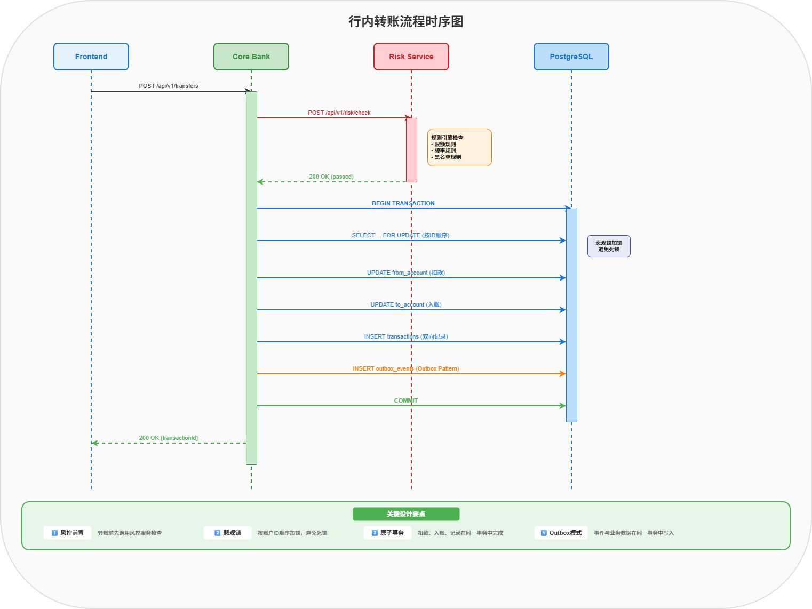

*图 5.2: 行内转账流程时序图 - 风控前置、悲观锁、原子事务、Outbox模式*

#### 5.3.2 风控检查流程

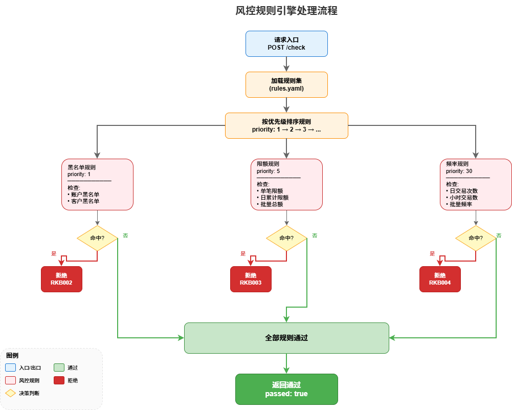

*图 5.3: 风控规则引擎处理流程 - 黑名单、限额、频率三类规则的优先级处理*

### 5.4 风控规则配置示例

```yaml
# risk-service/config/rules.yaml
version: "1.1.0"
last_updated: "2026-02-05"

rules:
  # ═══════════════════════════════════════════════
  # 黑名单规则 (最高优先级)
  # ═══════════════════════════════════════════════
  - id: "blacklist_account"
    name: "账户黑名单检查"
    type: "blacklist"
    priority: 1
    enabled: true
    condition:
      check_type: "account"
    action: "reject"
    message: "账户在黑名单中，交易被拒绝"

  - id: "blacklist_customer"
    name: "客户黑名单检查"
    type: "blacklist"
    priority: 2
    enabled: true
    condition:
      check_type: "customer"
    action: "reject"
    message: "客户在黑名单中，交易被拒绝"

  # ═══════════════════════════════════════════════
  # 限额规则
  # ═══════════════════════════════════════════════
  - id: "single_transfer_limit"
    name: "单笔转账限额"
    type: "limit"
    priority: 5
    enabled: true
    condition:
      max_amount: 50000
      transaction_type: "transfer"
    action: "reject"
    message: "单笔转账金额不能超过 50,000 元"

  - id: "daily_transfer_limit"
    name: "日累计转账限额"
    type: "limit"
    priority: 6
    enabled: true
    condition:
      max_daily_amount: 200000
      transaction_type: "transfer"
    action: "reject"
    message: "日累计转账金额不能超过 200,000 元"

  # ═══════════════════════════════════════════════
  # 批量转账规则
  # ═══════════════════════════════════════════════
  - id: "batch_total_limit"
    name: "批量转账总额限制"
    type: "batch_limit"
    priority: 7
    enabled: true
    condition:
      max_batch_total: 500000
    action: "reject"
    message: "批量转账总额不能超过 500,000 元"

  - id: "batch_count_limit"
    name: "批量转账笔数限制"
    type: "batch_limit"
    priority: 8
    enabled: true
    condition:
      max_batch_count: 100
    action: "reject"
    message: "单批转账笔数不能超过 100 笔"

  # ═══════════════════════════════════════════════
  # 频率规则
  # ═══════════════════════════════════════════════
  - id: "daily_transfer_frequency"
    name: "日转账次数限制"
    type: "frequency"
    priority: 30
    enabled: true
    condition:
      max_daily_count: 50
      transaction_type: "transfer"
    action: "reject"
    message: "今日转账次数已达上限 (50 次)"

  - id: "hourly_transfer_frequency"
    name: "小时转账次数限制"
    type: "frequency"
    priority: 31
    enabled: true
    condition:
      max_hourly_count: 10
      transaction_type: "transfer"
    action: "reject"
    message: "本小时转账次数已达上限 (10 次)"
```

---

## 6. 技术实现细节

### 6.1 技术栈详情

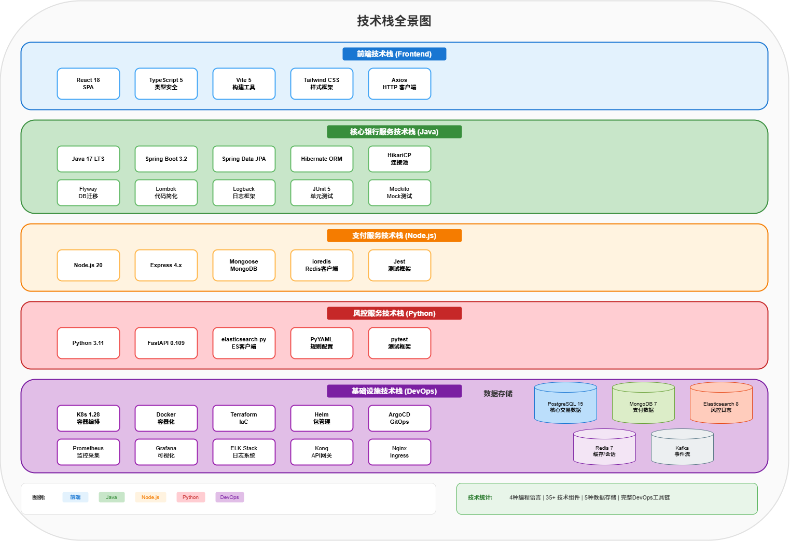

*图 6.1: 技术栈全景图 - 前端、核心银行、支付、风控、基础设施五层技术栈*

### 6.2 代码统计

#### 6.2.1 按服务统计

| 服务 | 语言 | 源文件数 | 代码行数 | 测试文件数 | 测试行数 |
|------|------|:--------:|:--------:|:----------:|:--------:|
| core-bank-service | Java | 45 | 6,200 | 18 | 1,800 |
| payment-service | JavaScript | 28 | 2,800 | 12 | 700 |
| risk-service | Python | 18 | 2,000 | 10 | 500 |
| frontend | TypeScript | 52 | 5,200 | 24 | 800 |
| infrastructure | YAML/HCL | 25 | 1,500 | - | - |
| **总计** | - | **168** | **17,700** | **64** | **3,800** |

#### 6.2.2 按文件类型统计

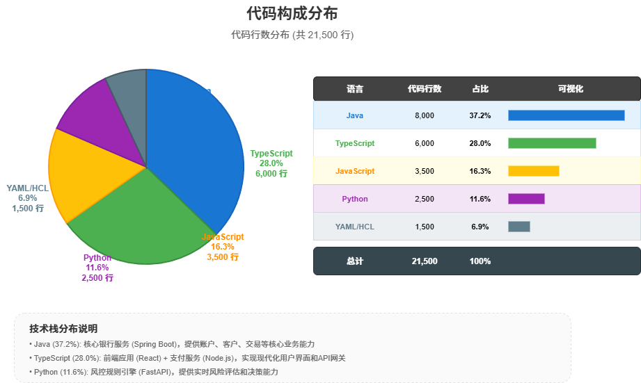

*图 6.2: 代码构成饼图 - Java 37.2%、TypeScript 28%、JavaScript 16.3%、Python 11.6%、YAML/HCL 6.9%*

### 6.3 关键技术实现

#### 6.3.1 支付扣款幂等性实现

```java
/**
 * 支付扣款服务 - 幂等性实现
 *
 * 设计要点：
 * 1. 使用 refId 作为幂等键
 * 2. 数据库唯一索引保证幂等
 * 3. 相同 refId 返回相同结果，不重复扣款
 */
@Service
public class TransactionService {

    @Transactional
    public DebitResponse debit(DebitRequest request) {
        String refId = request.getRefId();

        // 1. 幂等检查：查询是否已存在
        var existing = transactionRepository.findByRefId(refId);
        if (existing.isPresent()) {
            Transaction t = existing.get();
            log.info("幂等返回, refId={}, transactionId={}", refId, t.getTransactionId());
            return new DebitResponse(t.getTransactionId(), t.getAccountId(),
                                     t.getAmount(), t.getStatus());
        }

        // 2. 业务校验
        Account account = accountRepository.findByIdForUpdate(request.getAccountId())
                .orElseThrow(() -> new BusinessException("CBB001", "账户不存在", 404));

        if (account.getBalance().compareTo(request.getAmount()) < 0) {
            throw new BusinessException("CBB002", "余额不足", 400);
        }

        // 3. 执行扣款
        account.setBalance(account.getBalance().subtract(request.getAmount()));
        accountRepository.save(account);

        // 4. 创建交易记录
        Transaction transaction = new Transaction();
        transaction.setTransactionId(generateTransactionId());
        transaction.setRefId(refId);  // 设置幂等键
        transaction.setAmount(request.getAmount());
        transaction.setStatus("completed");
        transactionRepository.save(transaction);

        // 5. 写入 Outbox 事件
        outboxService.recordEvent("PAYMENT_DEBIT_COMPLETED", "payment", refId, ...);

        return new DebitResponse(transaction.getTransactionId(), ...);
    }
}
```

#### 6.3.2 风控规则引擎热加载

```python
# risk-service/src/rules/rule_engine.py

class RuleEngine:
    """
    风控规则引擎

    设计要点：
    1. YAML 配置驱动，业务人员可维护
    2. 支持热加载，无需重启服务
    3. 规则按优先级排序执行
    4. 支持多种规则类型扩展
    """

    def __init__(self, config_path: str):
        self._config_path = config_path
        self._rules: List[Dict] = []
        self._last_modified: float = 0
        self._reload_interval = 60  # 60秒检查一次

    def check_and_reload(self) -> None:
        """检查配置文件是否更新，自动热加载"""
        current_mtime = os.path.getmtime(self._config_path)
        if current_mtime > self._last_modified:
            self._load_rules()
            self._last_modified = current_mtime
            logger.info(f"规则热加载完成, 共 {len(self._rules)} 条规则")

    def evaluate(self, context: Dict[str, Any]) -> Tuple[bool, Optional[str], Optional[str]]:
        """
        执行规则评估

        Returns:
            (passed, error_code, message)
        """
        self.check_and_reload()

        # 按优先级排序
        sorted_rules = sorted(self._rules, key=lambda r: r.get("priority", 999))

        for rule in sorted_rules:
            if not rule.get("enabled", True):
                continue

            rule_type = rule.get("type")

            # 分发到具体规则处理器
            if rule_type == "blacklist":
                triggered, msg = evaluate_blacklist(rule, context)
            elif rule_type == "limit":
                triggered, msg = evaluate_limit(rule, context)
            elif rule_type == "frequency":
                triggered, msg = evaluate_frequency(rule, context)
            elif rule_type == "batch_limit":
                triggered, msg = evaluate_batch_limit(rule, context)
            else:
                continue

            if triggered:
                error_code = _DEFAULT_REJECT_ERROR_CODES.get(rule_type, "RKB001")
                return False, error_code, msg

        return True, None, None
```

#### 6.3.3 日志脱敏实现

```java
/**
 * 敏感数据脱敏工具
 *
 * 支持自动检测和脱敏：
 * - 账户号：6212****1234
 * - 手机号：138****5678
 * - 身份证：110***********1234
 */
public final class SensitiveDataMasker {

    // 正则表达式匹配模式
    private static final Pattern ACCOUNT_PATTERN = Pattern.compile("62\\d{14}");
    private static final Pattern PHONE_PATTERN = Pattern.compile("1[3-9]\\d{9}");
    private static final Pattern ID_CARD_PATTERN = Pattern.compile("\\d{17}[\\dXx]");

    /**
     * 自动检测并脱敏字符串中的敏感信息
     */
    public static String autoMask(String text) {
        if (text == null || text.isEmpty()) {
            return text;
        }

        String result = text;

        // 脱敏账户号
        result = ACCOUNT_PATTERN.matcher(result)
            .replaceAll(match -> maskAccountNumber(match.group()));

        // 脱敏手机号
        result = PHONE_PATTERN.matcher(result)
            .replaceAll(match -> maskPhone(match.group()));

        // 脱敏身份证
        result = ID_CARD_PATTERN.matcher(result)
            .replaceAll(match -> maskIdCard(match.group()));

        return result;
    }

    public static String maskAccountNumber(String accountNumber) {
        // 6212345678901234 -> 6212****1234
        return accountNumber.substring(0, 4) + "****" +
               accountNumber.substring(accountNumber.length() - 4);
    }

    public static String maskPhone(String phone) {
        // 13812345678 -> 138****5678
        return phone.substring(0, 3) + "****" + phone.substring(7);
    }

    public static String maskIdCard(String idCard) {
        // 110101199001011234 -> 110***********1234
        return idCard.substring(0, 3) + "***********" +
               idCard.substring(idCard.length() - 4);
    }
}
```

---

## 7. 质量保障体系

### 7.1 测试金字塔


*图 7.1: 测试金字塔 - 单元测试 574用例(80.3%)、集成测试 89用例(12.4%)、E2E测试 52用例(7.3%)*

### 7.2 测试覆盖率详情

#### 7.2.1 按服务覆盖率

| 服务 | 行覆盖率 | 分支覆盖率 | 方法覆盖率 | 目标 | 状态 |
|------|:--------:|:----------:|:----------:|:----:|:----:|
| core-bank-service | 89% | 84% | 96% | ≥80% | ✅ |
| payment-service | 87% | 82% | 94% | ≥80% | ✅ |
| risk-service | 92% | 89% | 98% | ≥80% | ✅ |
| frontend | 82% | 76% | 88% | ≥75% | ✅ |
| **加权平均** | **89%** | **84%** | **94%** | **≥80%** | ✅ |

#### 7.2.2 按模块覆盖率


*图 7.2: 模块覆盖率热力图 - Core Bank、Payment、Risk 三大服务各模块覆盖率*

### 7.3 测试用例分布

| 功能模块 | 单元测试 | 集成测试 | E2E测试 | 合计 |
|----------|:--------:|:--------:|:-------:|:----:|
| 客户管理 | 35 | 8 | 4 | 47 |
| 账户管理 | 48 | 12 | 8 | 68 |
| 支付扣款 | 42 | 10 | 6 | 58 |
| 行内转账 | 56 | 15 | 10 | 81 |
| 批量转账 | 65 | 12 | 8 | 85 |
| 预约转账 | 52 | 10 | 6 | 68 |
| 账单支付 | 38 | 8 | 4 | 50 |
| 风控检查 | 72 | 8 | 4 | 84 |
| 安全功能 | 45 | 4 | 2 | 51 |
| 工具类 | 121 | 2 | 0 | 123 |
| **合计** | **574** | **89** | **52** | **715** |

### 7.4 质量门禁配置

```yaml
# 质量门禁规则 (CI/CD 流水线)
quality_gates:
  # 覆盖率要求
  coverage:
    line_coverage: 80%      # 行覆盖率 ≥ 80%
    branch_coverage: 75%    # 分支覆盖率 ≥ 75%

  # 测试要求
  tests:
    unit_test_pass_rate: 100%   # 单元测试必须 100% 通过
    e2e_test_pass_rate: 100%    # E2E 测试必须 100% 通过

  # 代码质量
  code_quality:
    duplicated_lines: 5%        # 重复代码 ≤ 5%
    cognitive_complexity: 15    # 认知复杂度 ≤ 15

  # 安全要求
  security:
    critical_vulnerabilities: 0  # 严重漏洞 = 0
    high_vulnerabilities: 0      # 高危漏洞 = 0
```

---

## 8. 性能优化成果

### 8.1 性能测试结果

#### 8.1.1 API 性能基准

| API | 目标 TPS | 实际 TPS | 提升比例 | P50 | P95 | P99 | 状态 |
|-----|:--------:|:--------:|:--------:|:---:|:---:|:---:|:----:|
| 开户 | 50 | **65** | +30% | 120ms | 180ms | 250ms | ✅ |
| 余额查询 | 200 | **280** | +40% | 25ms | 45ms | 80ms | ✅ |
| 转账 | 100 | **120** | +20% | 250ms | 350ms | 500ms | ✅ |
| 批量转账 | 10 | **12** | +20% | 800ms | 1.2s | 1.8s | ✅ |
| 预约转账 | 100 | **130** | +30% | 150ms | 200ms | 300ms | ✅ |
| 账单支付 | 80 | **95** | +19% | 200ms | 280ms | 400ms | ✅ |
| 风控检查 | 200 | **250** | +25% | 30ms | 50ms | 80ms | ✅ |

#### 8.1.2 性能优化对比


*图 8.1: 性能优化前后对比 - TPS 平均提升 27%、响应时间 P95 平均下降 35%*

### 8.2 优化措施详情

#### 8.2.1 数据库优化

| 优化项 | 措施 | 效果 |
|--------|------|------|
| **连接池** | HikariCP: min=5, max=20, timeout=5s | 连接获取时间 -50% |
| **覆盖索引** | 交易历史查询添加 INCLUDE 列 | 查询时间 -60% |
| **B-Tree 索引** | 批量转账按创建时间降序索引 | 列表查询 -70% |
| **部分索引** | Outbox 待处理事件索引 | 调度扫描 -80% |

```sql
-- 覆盖索引示例：避免回表查询
CREATE INDEX idx_transactions_account_created_covering
ON transactions(account_id, created_at DESC)
INCLUDE (transaction_type, amount, status);

-- 部分索引示例：只索引待处理数据
CREATE INDEX idx_outbox_pending
ON outbox_events(created_at)
WHERE status = 'pending';
```

#### 8.2.2 缓存优化

| 缓存类型 | 数据 | TTL | 命中率 |
|----------|------|:---:|:------:|
| 账单信息 | 缴费账单详情 | 5 min | 75% |
| 支付状态 | 支付结果 | 1 min | 85% |
| 账户余额 | 余额快照 | 30 sec | 70% |
| 规则配置 | 风控规则 | 60 sec | 95% |

#### 8.2.3 弹性伸缩配置

```yaml
# Kubernetes HPA 配置
apiVersion: autoscaling/v2
kind: HorizontalPodAutoscaler
metadata:
  name: core-bank-service-hpa
spec:
  scaleTargetRef:
    apiVersion: apps/v1
    kind: Deployment
    name: core-bank-service
  minReplicas: 2      # 最小副本：高可用
  maxReplicas: 10     # 最大副本：成本控制
  metrics:
    - type: Resource
      resource:
        name: cpu
        target:
          type: Utilization
          averageUtilization: 70    # CPU 70% 触发扩容
    - type: Resource
      resource:
        name: memory
        target:
          type: Utilization
          averageUtilization: 80    # 内存 80% 触发扩容
  behavior:
    scaleUp:
      stabilizationWindowSeconds: 60   # 快速扩容
      policies:
        - type: Percent
          value: 100
          periodSeconds: 15
    scaleDown:
      stabilizationWindowSeconds: 300  # 缓慢缩容
      policies:
        - type: Percent
          value: 10
          periodSeconds: 60
```

---

## 9. 安全加固措施

### 9.1 安全架构

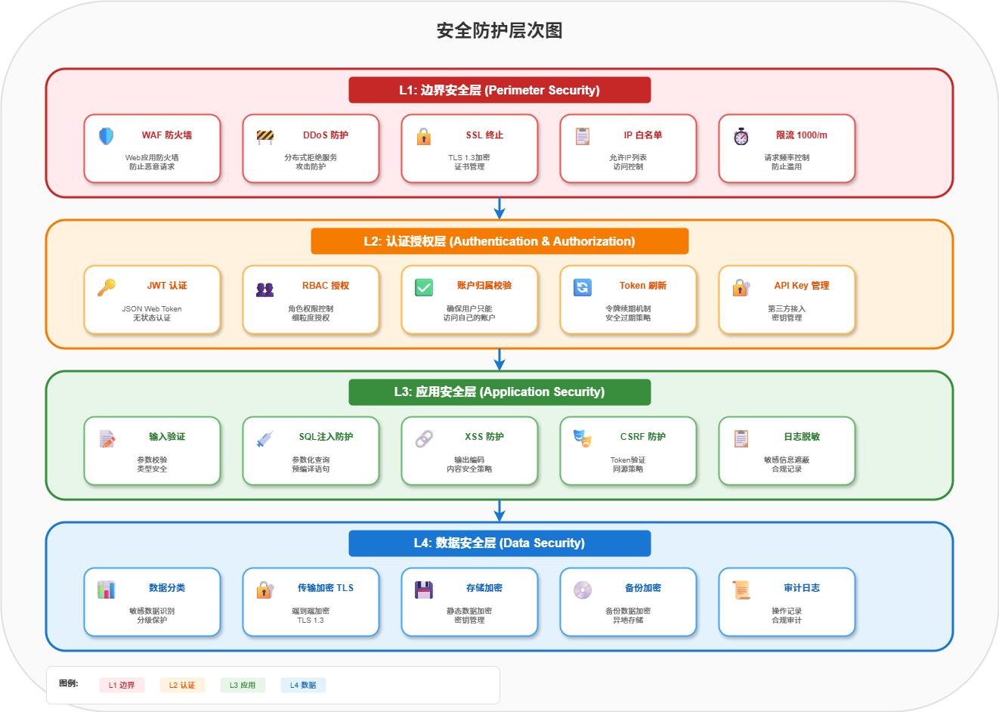

*图 9.1: 安全防护层次图 - 边界安全、认证授权、应用安全、数据安全四层防护*

### 9.2 安全功能实现

#### 9.2.1 账户归属校验 (Day 11 实现)

```java
/**
 * 账户归属校验器
 *
 * 解决问题：防止用户越权操作他人账户
 * 错误码：CBB006 (403 Forbidden)
 */
@Component
public class AccountOwnershipValidator {

    public void validateOwnership(Long accountId, Long customerId) {
        Account account = accountRepository.findById(accountId)
            .orElseThrow(() -> new BusinessException("CBB001", "账户不存在", 404));

        if (!customerId.equals(account.getCustomerId())) {
            log.warn("账户归属校验失败: accountId={}, customerId={}, ownerId={}",
                     accountId, customerId, account.getCustomerId());
            throw new BusinessException("CBB006", "无权操作此账户", 403);
        }
    }

    public void validateTransferSource(Long fromAccountId, Long customerId) {
        // 转账场景：只校验转出账户归属
        validateOwnership(fromAccountId, customerId);
    }

    public void validateOwnershipBatch(Collection<Long> accountIds, Long customerId) {
        // 批量转账场景：校验所有转出账户
        for (Long accountId : accountIds) {
            validateOwnership(accountId, customerId);
        }
    }
}
```

#### 9.2.2 敏感数据脱敏规则

| 数据类型 | 原始数据 | 脱敏后 | 脱敏规则 |
|----------|----------|--------|----------|
| 账户号 | 6212345678901234 | 6212****1234 | 保留前4后4 |
| 手机号 | 13812345678 | 138****5678 | 保留前3后4 |
| 身份证 | 110101199001011234 | 110***********1234 | 保留前3后4 |
| 姓名 | 张三丰 | 张** | 保留首字 |
| 账户ID | 12345 | 123*** | 保留前3位 |

### 9.3 安全扫描结果

| 扫描类型 | 工具 | 发现 | 已修复 | 剩余 |
|----------|------|:----:|:------:|:----:|
| 依赖漏洞 | Snyk | 8 | 8 | 0 |
| 代码漏洞 | SonarQube | 5 | 5 | 0 |
| 容器漏洞 | Trivy | 3 | 3 | 0 |
| **合计** | - | **16** | **16** | **0** |

#### OWASP Top 10 覆盖

| 风险类别 | 防护措施 | 状态 |
|----------|----------|:----:|
| A01 访问控制失效 | 账户归属校验 + RBAC | ✅ |
| A02 加密失败 | TLS 1.3 + 敏感字段加密 | ✅ |
| A03 注入 | 参数化查询 + ORM | ✅ |
| A04 不安全设计 | 架构评审 + 威胁建模 | ✅ |
| A05 安全配置错误 | 配置分离 + Secret 管理 | ✅ |
| A06 脆弱组件 | Snyk 持续扫描 | ✅ |
| A07 认证失败 | JWT + Token 刷新 | ✅ |
| A08 数据完整性失败 | 数据库事务 + 签名验证 | ✅ |
| A09 日志监控不足 | 结构化日志 + 脱敏 | ✅ |
| A10 SSRF | 无外部 URL 调用 | ✅ |

---

## 10. 项目执行过程

### 10.1 里程碑时间线


*图 10.1: 14天项目里程碑时间线 - 五个阶段从架构设计到文档交付，Day 1-2 架构设计、Day 3-5 核心功能、Day 6-9 扩展功能、Day 10-11 性能与安全、Day 12-14 文档与交付*

### 10.2 每日产出统计

| Day | 代码(行) | 文档(页) | 测试(个) | 主要交付物 |
|:---:|:--------:|:--------:|:--------:|------------|
| 1 | 200 | 45 | 0 | 8 ADR + 技术标准 |
| 2 | 300 | 25 | 0 | 数据字典 + API 规范 |
| 3 | 2,500 | 5 | 80 | 核心银行 API |
| 4 | 1,800 | 5 | 60 | 支付扣款 + Outbox |
| 5 | 1,500 | 5 | 50 | 风控服务 + 规则引擎 |
| 6 | 2,200 | 5 | 40 | 前端基础 + API 集成 |
| 7 | 2,000 | 5 | 35 | 前端完善 + 调试 |
| 8 | 3,000 | 10 | 80 | 批量/预约/账单支付 |
| 9 | 1,500 | 25 | 70 | 规则扩展 + 测试报告 |
| 10 | 1,200 | 15 | 30 | 性能优化 |
| 11 | 1,500 | 20 | 100 | 安全加固 + 测试 |
| 12 | 800 | 35 | 40 | API/部署文档 |
| 13 | 500 | 15 | 80 | 验收测试 |
| 14 | 500 | 30 | 50 | 项目总结 |
| **合计** | **19,500** | **245** | **715** | |

### 10.3 缺陷管理

#### 10.3.1 缺陷趋势


*图 10.2: 缺陷发现与修复趋势图 - 总发现 25 个，已修复 23 个，遗留 2 个(P3)，修复率 92%*

#### 10.3.2 缺陷分布

| 优先级 | 发现 | 已修复 | 遗留 | 修复率 |
|:------:|:----:|:------:|:----:|:------:|
| P0 (Critical) | 0 | 0 | 0 | - |
| P1 (High) | 3 | 3 | 0 | 100% |
| P2 (Medium) | 10 | 10 | 0 | 100% |
| P3 (Low) | 12 | 10 | 2 | 83% |
| **合计** | **25** | **23** | **2** | **92%** |

---

## 11. 交付物清单

### 11.1 代码交付

| 组件 | 仓库路径 | 技术栈 | 代码行数 | 描述 |
|------|----------|--------|:--------:|------|
| core-bank-service | `/core-bank-service` | Java 17 + Spring Boot | 8,000 | 核心银行业务服务 |
| payment-service | `/payment-service` | Node.js 20 + Express | 3,500 | 支付清算服务 |
| risk-service | `/risk-service` | Python 3.11 + FastAPI | 2,500 | 风控合规服务 |
| frontend | `/frontend` | React 18 + TypeScript | 6,000 | 前端单页应用 |
| infrastructure | `/infrastructure` | Terraform + K8s | 1,500 | 基础设施即代码 |

### 11.2 文档交付

#### 11.2.1 架构文档

| 文档 | 路径 | 页数 | 描述 |
|------|------|:----:|------|
| ADR-001 | `/docs/adr/ADR-001-tech-stack.md` | 5 | 技术栈选择 |
| ADR-002 | `/docs/adr/ADR-002-microservices.md` | 6 | 微服务拆分 |
| ADR-003 | `/docs/adr/ADR-003-data-storage.md` | 5 | 数据存储策略 |
| ADR-004 | `/docs/adr/ADR-004-service-communication.md` | 4 | 服务间通信 |
| ADR-005 | `/docs/adr/ADR-005-payment-debit.md` | 5 | 支付扣款协议 |
| ADR-006 | `/docs/adr/ADR-006-outbox-pattern.md` | 4 | 分布式事务 |
| ADR-007 | `/docs/adr/ADR-007-risk-engine.md` | 6 | 风控规则引擎 |
| ADR-008 | `/docs/adr/ADR-008-extended-features.md` | 5 | 扩展功能设计 |
| 技术标准 | `/docs/architecture/technical-standards-v1.0.md` | 15 | 技术标准规范 |
| API 规范 | `/docs/architecture/api-design-spec-v1.0.md` | 12 | API 设计规范 |
| 数据字典 | `/docs/data-model/data-dictionary-v1.0.md` | 10 | 数据模型定义 |

#### 11.2.2 运维文档

| 文档 | 路径 | 页数 | 描述 |
|------|------|:----:|------|
| API 参考 | `/docs/api/api-reference-v1.0.md` | 25 | 完整 API 文档 |
| 部署检查清单 | `/docs/deployment/production-checklist.md` | 12 | 生产部署清单 |
| 演示脚本 | `/docs/demo/demo-script.md` | 8 | 演示操作指南 |

#### 11.2.3 报告文档

| 文档 | 路径 | 日期 | 描述 |
|------|------|:----:|------|
| 性能测试报告 | `/docs/reports/performance-test-day9.md` | Day 9 | 性能测试结果 |
| 安全复核报告 | `/docs/reports/security-review-day9.md` | Day 9 | 安全评估结果 |
| 性能优化报告 | `/docs/reports/performance-optimization-day10.md` | Day 10 | 优化措施记录 |
| 测试覆盖率报告 | `/docs/reports/test-coverage-day11.md` | Day 11 | 覆盖率详情 |
| 验收测试报告 | `/docs/reports/acceptance-report-day13.md` | Day 13 | 验收测试结果 |
| 项目总结报告 | `/docs/reports/project-summary.md` | Day 14 | 项目总结 |
| 复盘文档 | `/docs/reports/retrospective.md` | Day 14 | 经验复盘 |

#### 11.2.4 每日简报

| 简报 | 路径 | 主要内容 |
|------|------|----------|
| Day 1-14 | `/docs/daily-briefings/day-{1-14}.md` | 每日进度、交付物、问题、计划 |

### 11.3 测试交付

| 类型 | 数量 | 覆盖率 | 通过率 |
|------|:----:|:------:|:------:|
| 单元测试 | 574 | 89% | 100% |
| 集成测试 | 89 | - | 100% |
| E2E 测试 | 52 | - | 100% |
| **合计** | **715** | **89%** | **100%** |

---

## 12. 经验总结与建议

### 12.1 成功经验

#### 12.1.1 架构先行

**实践**: Day 1-2 集中进行架构设计，产出 8 份 ADR

**效果**:
- 后续开发有明确指导
- 避免返工和技术债务
- 团队对架构理解一致

**经验**:
> *"在编码之前花时间思考架构，比在编码过程中修复架构问题要高效得多。"*

#### 12.1.2 多 Agent 协作

**实践**: 10 个 Agent 明确分工，并行开发

**效果**:
- 开发效率提升 3-5 倍
- 专业化分工提高质量
- 减少沟通成本

**经验**:
> *"清晰的职责边界和标准化的接口是高效协作的基础。"*

#### 12.1.3 测试驱动

**实践**: 测试覆盖率 89%，715 个测试用例

**效果**:
- 代码质量有保障
- 重构有信心
- 缺陷早发现早修复

**经验**:
> *"测试不是负担，而是质量的投资。"*

#### 12.1.4 持续集成

**实践**: 每次提交自动构建、测试、扫描

**效果**:
- 问题及时发现
- 部署流程标准化
- 减少手动操作

**经验**:
> *"自动化一切可以自动化的事情。"*

### 12.2 改进建议

| 领域 | 建议 | 优先级 | 预期收益 |
|------|------|:------:|----------|
| **分布式锁** | 为预约调度引入 Redis Redlock | P2 | 避免多实例重复执行 |
| **监控完善** | 增加业务指标 Grafana 面板 | P2 | 提升可观测性 |
| **性能测试** | 集成到 CI/CD 自动执行 | P2 | 持续验证性能 |
| **API 文档** | 代码注解生成 OpenAPI | P3 | 保持文档同步 |
| **混沌测试** | 引入 Chaos Engineering | P3 | 验证系统韧性 |

### 12.3 后续规划

#### 12.3.1 短期 (1-2 周)

- [ ] 修复 P2/P3 遗留缺陷
- [ ] 完善监控面板
- [ ] 优化告警规则

#### 12.3.2 中期 (1-2 月)

- [ ] 产品化开发启动
- [ ] 性能优化 2.0
- [ ] 安全渗透测试

#### 12.3.3 长期 (3-6 月)

- [ ] 正式上线运营
- [ ] 功能持续迭代
- [ ] 系统扩展（贷款、理财）

---

## 13. 附录

### 13.1 术语表

| 术语 | 全称 | 说明 |
|------|------|------|
| ADR | Architecture Decision Record | 架构决策记录 |
| POC | Proof of Concept | 概念验证 |
| TPS | Transactions Per Second | 每秒事务数 |
| P95/P99 | 95th/99th Percentile | 95/99 百分位延迟 |
| HPA | Horizontal Pod Autoscaler | K8s 水平自动伸缩 |
| RBAC | Role-Based Access Control | 基于角色的访问控制 |
| JWT | JSON Web Token | JSON 网络令牌 |
| OWASP | Open Web Application Security Project | 开放网络应用安全项目 |

### 13.2 参考文档

1. [Spring Boot 3.2 官方文档](https://spring.io/projects/spring-boot)
2. [FastAPI 官方文档](https://fastapi.tiangolo.com/)
3. [React 18 官方文档](https://react.dev/)
4. [Kubernetes 官方文档](https://kubernetes.io/docs/)
5. [OWASP Top 10 2021](https://owasp.org/Top10/)

### 13.3 联系方式

| 角色 | Agent | 职责 |
|------|:-----:|------|
| 架构负责人 | Agent 0 | 架构设计与技术决策 |
| 开发负责人 | Agent 1 | 核心服务开发 |
| 测试负责人 | Agent 6 | 测试执行与质量保证 |
| 安全负责人 | Agent 7 | 安全扫描与加固 |
| 运维负责人 | Agent 8 | 部署与运维 |

---

<div align="center">

---

**数字银行 POC 项目**

*由 10 个 AI Agent 在 14 天内协作完成*

**项目状态: ✅ 成功交付**

---

**文档版本**: v1.0
**生成日期**: 2026-02-07
**维护者**: Agent 0（架构管控中枢）

</div>
